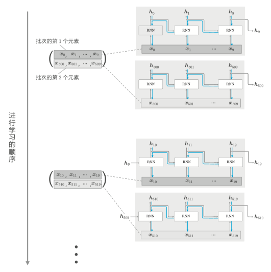

This repository is truncated time Long Short-Term Memory Network. We generate the data to test the performence of the base lstm. That is notable we use batch time series data by crearte a new dataloader for transform the time series data into truncated time series data. 
